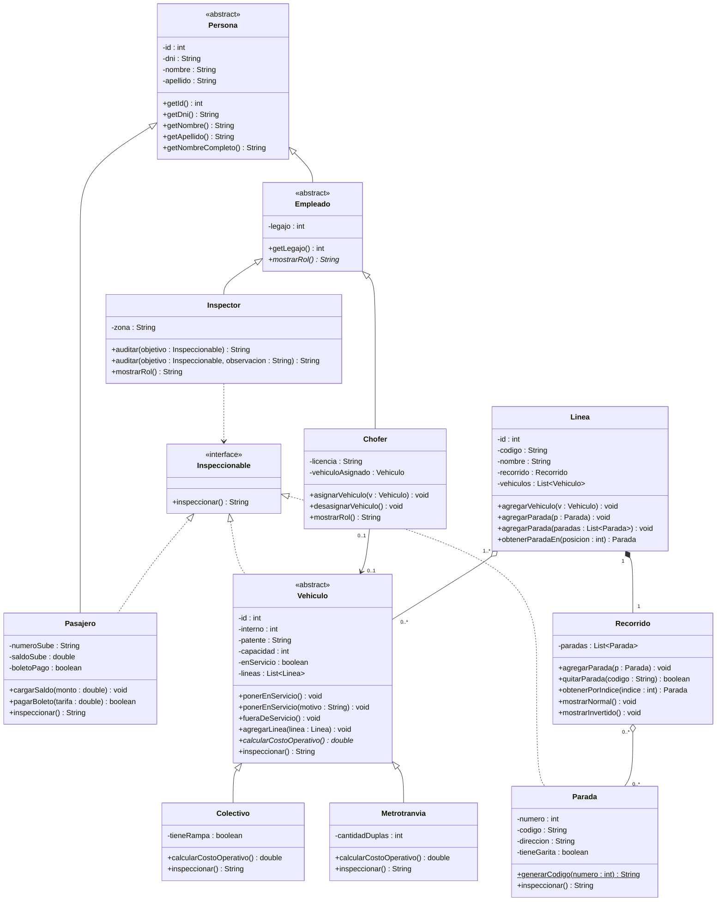

```mermaid
classDiagram
    direction TB

    class Inspeccionable {
        <<interface>>
        +inspeccionar() String
    }

    class Persona {
        <<abstract>>
        -id : int
        -dni : String
        -nombre : String
        -apellido : String
        +getId() int
        +getDni() String
        +getNombre() String
        +getApellido() String
        +getNombreCompleto() String
    }

    class Pasajero {
        -numeroSube : String
        -saldoSube : double
        -boletoPago : boolean
        +cargarSaldo(monto : double) void
        +pagarBoleto(tarifa : double) boolean
        +inspeccionar() String
    }

    class Empleado {
        <<abstract>>
        -legajo : int
        +getLegajo() int
        +mostrarRol()* String
    }

    class Chofer {
        -licencia : String
        -vehiculoAsignado : Vehiculo
        +asignarVehiculo(v : Vehiculo) void
        +desasignarVehiculo() void
        +mostrarRol() String
    }

    class Inspector {
        -zona : String
        +auditar(objetivo : Inspeccionable) String
        +auditar(objetivo : Inspeccionable, observacion : String) String
        +mostrarRol() String
    }

    class Vehiculo {
        <<abstract>>
        -id : int
        -interno : int
        -patente : String
        -capacidad : int
        -enServicio : boolean
        -lineas : List~Linea~
        +ponerEnServicio() void
        +ponerEnServicio(motivo : String) void
        +fueraDeServicio() void
        +agregarLinea(linea : Linea) void
        +calcularCostoOperativo()* double
        +inspeccionar() String
    }

    class Colectivo {
        -tieneRampa : boolean
        +calcularCostoOperativo() double
        +inspeccionar() String
    }

    class Metrotranvia {
        -cantidadDuplas : int
        +calcularCostoOperativo() double
        +inspeccionar() String
    }

    class Linea {
        -id : int
        -codigo : String
        -nombre : String
        -recorrido : Recorrido
        -vehiculos : List~Vehiculo~
        +agregarVehiculo(v : Vehiculo) void
        +agregarParada(p : Parada) void
        +agregarParada(paradas : List~Parada~) void
        +obtenerParadaEn(posicion : int) Parada
    }

    class Recorrido {
        -paradas : List~Parada~
        +agregarParada(p : Parada) void
        +quitarParada(codigo : String) boolean
        +obtenerPorIndice(indice : int) Parada
        +mostrarNormal() void
        +mostrarInvertido() void
    }

    class Parada {
        -numero : int
        -codigo : String
        -direccion : String
        -tieneGarita : boolean
        +generarCodigo(numero : int)$ String
        +inspeccionar() String
    }

    Persona <|-- Pasajero
    Persona <|-- Empleado
    Empleado <|-- Chofer
    Empleado <|-- Inspector

    Inspeccionable <|.. Pasajero
    Inspeccionable <|.. Vehiculo
    Inspeccionable <|.. Parada

    Vehiculo <|-- Colectivo
    Vehiculo <|-- Metrotranvia

    Chofer "0..1" --> "0..1" Vehiculo
    Inspector ..> Inspeccionable

    Linea "1..*" o-- "0..*" Vehiculo
    Linea "1" *-- "1" Recorrido
    Recorrido "0..*" o-- "0..*" Parada
```
